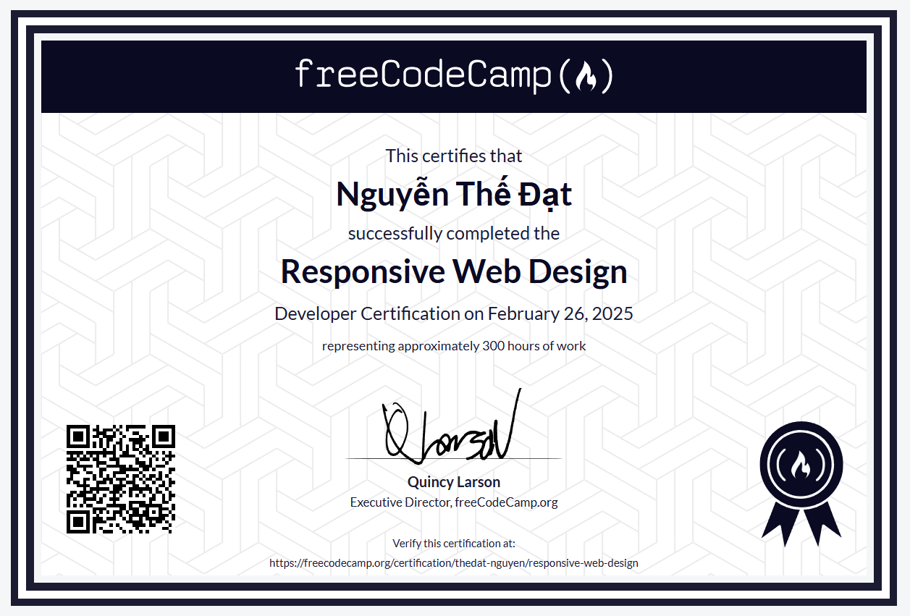

# Responsive Web Design Projects

As part of the Responsive Web Design certification, several projects have been developed and successfully completed. These projects include:

- **Build a Survey Form**: A survey form that allows users to input their information and submit feedback.
- **Build a Tribute Page**: A tribute page where users can showcase and honor an important person or event.
- **Build a Technical Documentation Page**: A technical documentation page that provides detailed information and usage instructions for a specific technology or product.
- **Build a Product Landing Page**: A product landing page designed to promote and showcase a product or service.
- **Build a Personal Portfolio Webpage**: A personal portfolio webpage where users can showcase their projects, skills, and contact information.

All automated tests for these projects have been passed, demonstrating proficiency in implementing fundamental web design concepts and best practices.

## Feel free to explore

Feel free to explore and refer to these projects for learning purposes. The solutions implemented follow best practices and provide clear examples of how to approach common web design challenges. 
Whether you're just starting out or looking to improve your skills, these projects can serve as valuable resources to deepen your understanding of responsive web design.

---

